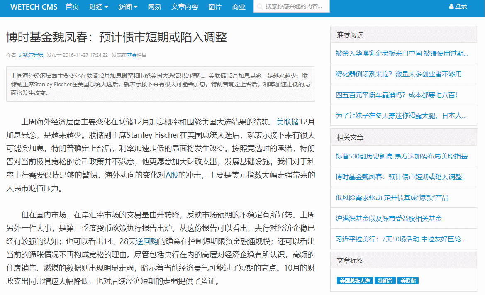
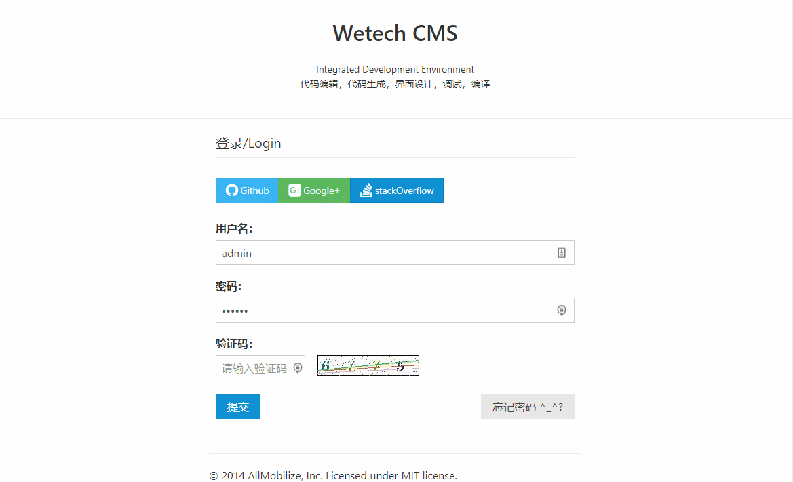
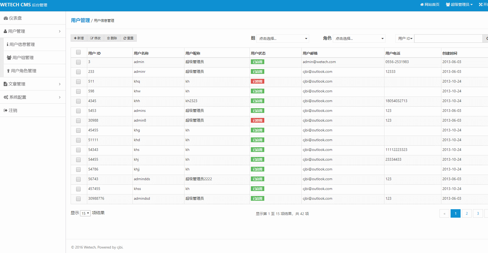
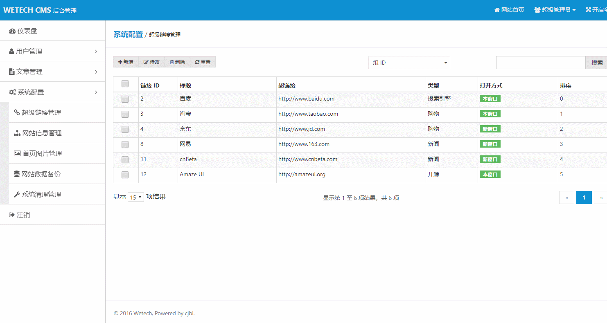
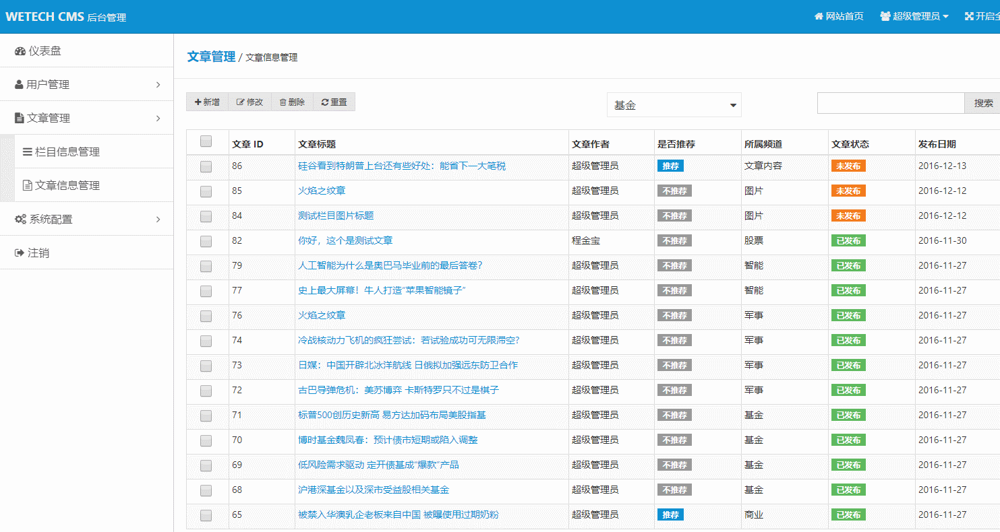

# wetech-cms
wetech cms是本人自己整合开发的一套内容管理系统。旨在开发一个通用的、可持续开发集成的、方便扩展的cms系统，目前主要用来替代本人的wordpress博客
---

## 项目介绍

>首页使用freemarker完全静态化处理，减轻服务器和数据库的压力
>后台相关js只在第一次登录时加载，各功能网页通过ajax load到content div中，包括异步前后台表单验证，所有的请求都是通过ajax来完成。
>批量删除功能，查询、新增、修改全部在一个网页当中，减少与服务器交互
>对datatables进行封装，增删改查基本的操作封装成插件，降低开发难度
>严格的代码规范，对于每个类都有对应的单元测试覆盖

## 模块介绍
>   1. wetech-parent

是所有子模块的父类，同时也是项目聚合器，以及版本申明管理，无实质代码

>   2. wetech-basic-common

主要是放一些通用工具类

>   3. wetech-basic-hibernate

对hibernate进行封装，目前就放了IBaseDao和BaseDao

>   4. wetech-core

项目核心模块，用来放POJO、DAO对象，以及ORM映射

>   5. wetech-topic

服务层文章相关

>   7. wetech-user

服务层用户相关

>   6. wetech-web

用来放前台页面，以及控制层相关代码

## 技术选型

### 后端技术

技术 | 名称 | 版本 | 官网
----|------|----|----
Spring Framework | 容器 | 4.3.5.RELEASE | [http://projects.spring.io/spring-framework/](http://projects.spring.io/spring-framework/)
SpringMVC | MVC框架 | 4.3.5.RELEASE |  [http://docs.spring.io/spring/docs/current/spring-framework-reference/htmlsingle/#mvc](http://docs.spring.io/spring/docs/current/spring-framework-reference/htmlsingle/#mvc)
Hibernate | ORM框架 | 4.2.0.Final |  [http://hibernate.org/](http://hibernate.org/)
Maven | 项目构建管理 | 4.0.0 |  [http://maven.apache.org](http://maven.apache.org/)
Freemarker | 模板引擎 | 2.3.23 |  [https://freemarker.apache.org/](https://freemarker.apache.org/)
Logback | 日志组件 | 1.1.3 |  [https://logback.qos.ch](https://logback.qos.ch/)
Dbcp2 | 数据库连接池 | 2.1.1 |  [https://github.com/alibaba/druid](https://github.com/alibaba/druid)
Hibernate Validator | 后端校验框架 | 5.4.2.Final | [http://hibernate.org/validator/](http://hibernate.org/validator/)
DWR | WEB远程调用框架 | 3.0.1-RELEASE | [http://directwebremoting.org/dwr/index.html](http://directwebremoting.org/dwr/index.html)
Thumbnailator | 生成高质量缩略图的Java类库 | 0.4.3 | [https://github.com/coobird/thumbnailator](https://github.com/coobird/thumbnailator)

### 前端技术

技术 | 名称 | 版本 |  官网
----|------|----|----
jQuery | 优秀的Javascript库 | 3.1.1 |  [http://jquery.com/](http://jquery.com/)
Amaze UI | 前端框架 | 2.7.2 |  [http://amazeui.org/](http://amazeui.org/)
DataTables | 数据表格 | 1.10.16 |  [https://www.datatables.net/](https://www.datatables.net/)
Layer | jQuery弹出层插件 | 3.0.1 |  [http://layer.layui.com/](http://layer.layui.com/)
ZTree | jQuery树插件 | 3.5.12 |  [http://www.treejs.cn](http://www.treejs.cn)

## 软件需求

- JDK1.8+
- MySQL5.6+
- Tomcat7.0+/jetty9.0+
- Maven3.0+

## 本地部署

- 通过git下载源码
- 创建数据库wetech_cms，数据库编码为UTF-8
- 执行docs/sql/init.sql文件，初始化数据
- 修改wetech-core模块下jdbc.properties文件，更改MySQL账号和密码
- 在项目根模块执行【mvn clean package】
- 在wetech-core模块执行【mvn jetty:run】命令，即可运行项目
- 项目访问路径：http://localhost:8888/wetech-cms
- 账号密码：admin/123456

## 预览图

> 首页

> 文章页

> 登陆页

> 后台管理页

## 在线访问

### 预览地址

[http://wetech.tech/wetech-cms](http://wetech.tech/wetech-cms "demo")

## 许可证

wetech-cms 使用 MIT 许可证发布，用户可以自由使用、复制、修改、合并、出版发行、散布、再授权及贩售wetech-cms 及其副本。

## 获取源码

 [https://github.com/cjbi/wetech-cms](https://github.com/cjbi/wetech-cms "github")

 [https://gitee.com/cjbi/wetech-cms](https://gitee.com/cjbi/wetech-cms "gitee")

